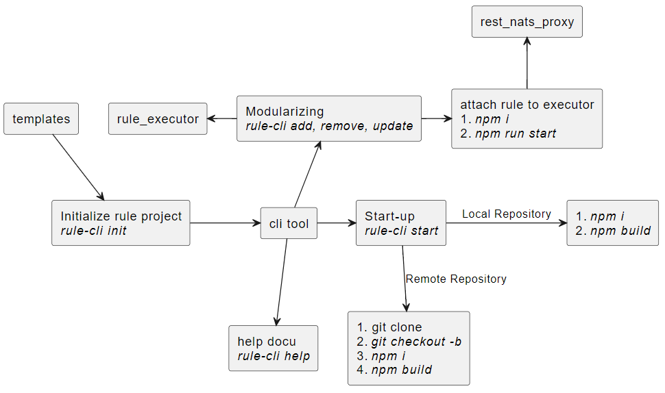

<!-- SPDX-License-Identifier: Apache-2.0 -->

# Rule Command Line Interface Documentation

* * *

## Overview

`rule-cli` is a command-line interface (CLI) tool designed to facilitate the initialization, management, and deployment of rule-based projects. The tool provides commands for tasks such as initializing a project from a template, managing modules, starting a rule project, and removing rules or modules. This CLI tool is mainly intended to help developers have an easy time testing their code when working with rules to be specific.

Below is the design diagram for the rule-cli tool :



# How does it work?

### Requirements

1. updated git (*configured)*
2. npm node package manager
3. node v18+

### Installation

```bash
npm install -g rule-cli
```

For developer process

```bash
git clone https://github.com/frmscoe/rule-cli.git
cd rule-cli
npm i
npm run build
npm install -g .
```

## Commands

### `init`

Initialize a rule project from a template.

```bash
rule-cli init
```

### `module`

Manage modules of `rule-cli` by adding, removing, starting, or specifying environment variables.

```bash
rule-cli module <add|remove|start|env> <modulename> \[options\]
```

Options:

- `-s, --env-source [source-address]`: Local address of `.env` that can be used with this module.

> *Note: The path supplied to this option needs to end with .env to show that it pointing to an environment file.*

### `start`

Start a rule project. Ensure that the `rule-executor` module is present, as every rule module will listen to default ports.

```bash
rule-cli start \[options\]
```

Options:

- `-r, --repo-name <reponame>`: Specify a GitHub repository name.
- `-b, --branch-name <branchname>`: Specify a branch to pull.
- `-o, --open-vs`: Open Visual Studio Code.

### `remove`

Remove a rule from the CLI host or module.

```bash
rule-cli remove \[options\]
```

Options:

- `-r, --rule-name <rulename@version>`: Specify a rule name to remove in the format `rule-000@1.0.0`.
- `-m, --module-name <modulename>`: Specify a module name to remove.

## Examples

### Initialize a Project:

```bash
rule-cli init
```

### Manage Modules:

```bash
# Add a module
rule-cli module add rule-executor

# Remove a module
rule-cli module remove rule-executor

# Start a module
rule-cli module start rule-executor

# Specify environment variables for a module
rule-cli module env rule-executor -s /path/to/env-file
```

### Start a Rule Project:

```bash
rule-cli start -r my-repo -b main -o
```

### Remove a Rule or Module:

```bash
# Remove a rule
rule-cli remove -r rule-000@1.0.0

# Remove a module
rule-cli remove -m rule-executor
```

## Summary

`rule-cli` aims to aid with easy testing rules from local to remote source code target, additional features like initializing a rule from template to make you get ready as soon as possible to get started with the important parts of your logic.

* * *
